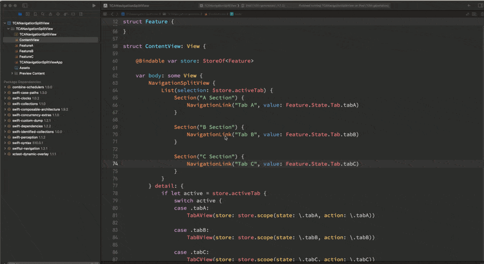

## Description

* Tab A with `NavigationStack`
* Tab B with `NavigationStack`
* Tab C without `NavigationStack`

Building a view hierarchy with `NavigationSplitView` and the detail view build with `NavigationStack(path:destination)` api, it cause crash.

For example:

* A -> B (crash)
* A -> C -> B (ok)